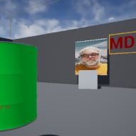

# Project Name  MDEV1003w23

## Description

A github repository for the in class demonstrations.   
 
Attributions: 
1. audio popping sound, Bubbles pop, OpenGameArt.org https://opengameart.org/content/bubbles-pop 
2. background music - Crystal Cave, OpenGameArt.org, https://opengameart.org/content/applause
3. Bing sound, Brian MacIntosh, Opengameart, https://opengameart.org/content/metal-impact-sounds
4. Mountain landscape, Pexels, https://www.pexels.com/photo/landscape-photography-of-snowy-mountain-1366919/
5. Toy rocket ship, SM_Childrens_Room_Decor_5 from Interk Modern House asset pack, ( https://www.unrealengine.com/marketplace/en-US/product/modern-house )
6. House plant, SM_Decor_5 from Interk Modern House asset pack, ( https://www.unrealengine.com/marketplace/en-US/product/modern-house ) 
7. Stadium backdrop, Sergej Majboroda @polyhaven ( https://polyhaven.com/a/stadium_01 )
8. Splat modified from bloodsplats_0004.png  decal from ( https://opengameart.org/content/blood-splats )

## Usage
Clone, or download the zip, to a local directory. Open in Unreal Engine 4.27 or newer

