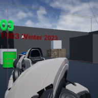

# Project Name  MDEV1003w23

## Description

A github repository for the in class demonstrations.   
 
Attributions: 
1. audio popping sound, Bubbles pop, OpenGameArt.org https://opengameart.org/content/bubbles-pop 
2. background music - Crystal Cave, OpenGameArt.org, https://opengameart.org/content/applause

## Usage
Clone, or download the zip, to a local directory. Open in Unreal Engine 4.27 or newer

